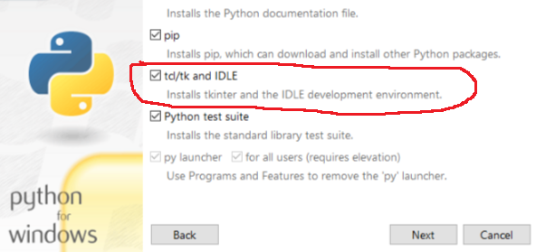

<h1>Aqua Encrypter GUI</h1>

A text encrypter based on stream cipher symmetric key encryption algorithm.

---

<h3>Index</h3>

- [Dependencies](#dependencies)
- [Installation](#installation)
  - [Linux (Ubuntu)](#linux-ubuntu)
  - [Windows](#windows)
- [Executing](#executing)
- [How it works](#how-it-works)
  - [Symmetric Encription](#symmetric-encription)
  - [Stream ciphers](#stream-ciphers)

---

# Dependencies

- [Python 3](https://www.python.org/downloads/)

- [tkinter for Python 3](https://docs.python.org/3/library/tkinter.html)

# Installation

## Linux (Ubuntu)

1. Install Python 3 from [its official website](https://www.python.org/downloads/)
2. Install tkinter for Python 3 with:

```shell
$ sudo apt install python3-tk
```

## Windows

Install Python 3 from [its official website](https://www.python.org/downloads/) and, during the installation process, check the Tcl/Tk option:



---

# Executing

Navigate into this directory within a shell, then run:

```shell
$ python3 -m aqua_encrypter
```

In PowerShell:

```powershell
> python -m aqua_encrypter
```

---

# How it works

The core algorithm for this program takes a text file and a password as input, then add each character of the text to the corresponding character of the password, generating the ciphertext.

## Symmetric Encription

Symmetric encryption is a type of encryption where only one key is used to encrypt and decrypt data.

## Stream ciphers

Stream ciphers encrypt content using a stream key which, combined with the content to be encrypted, generates the ciphertext.

---
